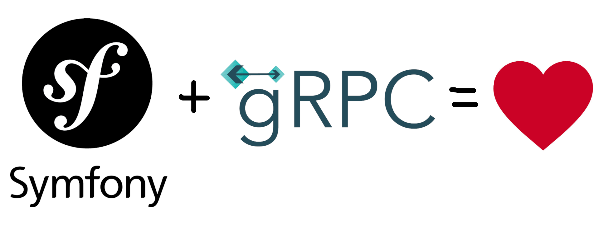

# PHP gRPC Demo project "Url shortener"

This is example implementation of [gRPC](https://grpc.io/) 
server and client on [PHP](https://www.php.net/), using framework [Symfony](https://symfony.com/). 

This project is an addition to the article [https://igancev.ru/2023-08-14-grpc-server-on-symfony](https://igancev.ru/2023-08-14-grpc-server-on-symfony)



## Run

### Prepare

Install dependencies:

```shell
docker-compose build && docker-compose run rr composer i
```

Download Roadrunner binary:

```
docker-compose run rr ./vendor/bin/rr get-binary -l ./bin
```

### Start gRPC server

```bash
docker-compose up
```

### Run gRPC client

```
docker-compose exec rr bin/console shortener:shorten
```

Bye, bye! 🤚